# MCP Server Domain Graph

Two graph views over the catalog in [`catalog.md`](catalog.md).

- **View 1 — Asset domain → Servers**: visual clustering of MCP servers
  by the asset class they expose.
- **View 2 — Asset domain → Operation types**: which atomic operations
  (from [`../standards/atomic-op-classification.md`](../standards/atomic-op-classification.md))
  show up in each domain. Used to connect this catalog to the scoring
  framework.

Both views use the same domain set as the catalog.

---

## View 1 — Asset domain → Servers

```mermaid
graph LR
  Catalog((MCP catalog))

  %% domain nodes
  D1[Local filesystem]
  D2[Source code / VCS]
  D3[Databases]
  D4[Messaging]
  D5[Productivity / docs]
  D6[Browser / web]
  D7[Cloud infra / IaC]
  D8[Search / extraction]
  D9[AI / ML services]
  D10[Finance / payments]
  D11[Monitoring]
  D12[Identity / sec-tools]
  D13[Code execution]
  D14[Knowledge / memory]
  D15[Maps / location]
  D16[Utility]

  Catalog --> D1
  Catalog --> D2
  Catalog --> D3
  Catalog --> D4
  Catalog --> D5
  Catalog --> D6
  Catalog --> D7
  Catalog --> D8
  Catalog --> D9
  Catalog --> D10
  Catalog --> D11
  Catalog --> D12
  Catalog --> D13
  Catalog --> D14
  Catalog --> D15
  Catalog --> D16

  %% representative servers per domain (subset shown for readability)
  D1 --> filesystem
  D1 --> markitdown
  D1 --> box

  D2 --> git
  D2 --> github-official[github official]
  D2 --> gitlab
  D2 --> gitea
  D2 --> azure-devops
  D2 --> bitbucket

  D3 --> sqlite
  D3 --> postgres
  D3 --> redis
  D3 --> supabase
  D3 --> neon
  D3 --> snowflake
  D3 --> clickhouse
  D3 --> mongodb
  D3 --> qdrant
  D3 --> chroma
  D3 --> pinecone
  D3 --> neo4j
  D3 --> dbt
  D3 --> databricks
  D3 --> airtable

  D4 --> slack
  D4 --> teams
  D4 --> discord
  D4 --> telegram
  D4 --> whatsapp
  D4 --> infobip
  D4 --> line
  D4 --> ms365
  D4 --> agentmail
  D4 --> discourse

  D5 --> gdrive
  D5 --> notion
  D5 --> jira
  D5 --> confluence
  D5 --> google-workspace
  D5 --> calendar
  D5 --> teamwork

  D6 --> fetch
  D6 --> puppeteer
  D6 --> playwright[playwright Microsoft]
  D6 --> browserbase
  D6 --> browser-use

  D7 --> aws-labs[awslabs/mcp]
  D7 --> cloudflare
  D7 --> terraform
  D7 --> pulumi
  D7 --> kubernetes
  D7 --> azure-cli
  D7 --> localstack
  D7 --> alibaba

  D8 --> brave
  D8 --> exa
  D8 --> tavily
  D8 --> firecrawl
  D8 --> apify
  D8 --> brightdata
  D8 --> kagi
  D8 --> perplexity[perplexity sonar]
  D8 --> agentql
  D8 --> vectorize

  D9 --> everart
  D9 --> imagen3
  D9 --> fal
  D9 --> openai-image
  D9 --> grok
  D9 --> openai-bridge
  D9 --> gemini-bridge
  D9 --> ollama-bridge

  D10 --> stripe
  D10 --> polygon
  D10 --> base-coinbase[base coinbase]
  D10 --> alpaca
  D10 --> investor-agent

  D11 --> sentry
  D11 --> grafana
  D11 --> prometheus
  D11 --> dynatrace
  D11 --> logfire
  D11 --> raygun
  D11 --> panther
  D11 --> zabbix
  D11 --> netdata

  D12 --> onepassword
  D12 --> semgrep
  D12 --> snyk
  D12 --> osv
  D12 --> shodan
  D12 --> virustotal
  D12 --> maigret
  D12 --> cve-search

  D13 --> yepcode
  D13 --> pydantic-run-python
  D13 --> e2b
  D13 --> dagger-container-use
  D13 --> desktop-commander
  D13 --> serena
  D13 --> vscode
  D13 --> iterm

  D14 --> memory-official[memory official]
  D14 --> sequentialthinking
  D14 --> graphlit
  D14 --> mcp-memory-service
  D14 --> zotero

  D15 --> google-maps

  D16 --> everything-server[everything official]
  D16 --> time-server[time official]
```

---

## View 2 — Asset domain → Operation types

Operation types are the 13 atomic ops from `atomic-op-classification.md`:
`READ`, `WRITE`, `MODIFY`, `OVERWRITE`, `DELETE`, `MOVE`, `CREATE`,
`SEARCH`, `LIST`, `METADATA`, `BROADCAST`, `EXECUTE`, `SCHEMA_MODIFY`.

```mermaid
graph LR
  classDef destructive fill:#ffd6d6,stroke:#b91c1c
  classDef exec fill:#ffe7b3,stroke:#b45309
  classDef readish fill:#dbeafe,stroke:#1d4ed8
  classDef neutral fill:#e5e7eb,stroke:#374151

  D1[Local filesystem]
  D2[Source code / VCS]
  D3[Databases]
  D4[Messaging]
  D5[Productivity / docs]
  D6[Browser / web]
  D7[Cloud infra / IaC]
  D8[Search / extraction]
  D9[AI / ML services]
  D10[Finance / payments]
  D11[Monitoring]
  D12[Identity / sec-tools]
  D13[Code execution]
  D14[Knowledge / memory]
  D15[Maps / location]
  D16[Utility]

  %% Local filesystem
  D1 --> O_FS_READ[READ]:::readish
  D1 --> O_FS_LIST[LIST]:::readish
  D1 --> O_FS_SEARCH[SEARCH]:::readish
  D1 --> O_FS_META[METADATA]:::readish
  D1 --> O_FS_WRITE[WRITE]
  D1 --> O_FS_MODIFY[MODIFY]
  D1 --> O_FS_OVERWRITE[OVERWRITE]:::destructive
  D1 --> O_FS_MOVE[MOVE]
  D1 --> O_FS_CREATE[CREATE]
  D1 --> O_FS_DELETE[DELETE]:::destructive

  %% Source code / VCS
  D2 --> O_VCS_READ[READ]:::readish
  D2 --> O_VCS_LIST[LIST]:::readish
  D2 --> O_VCS_SEARCH[SEARCH]:::readish
  D2 --> O_VCS_WRITE[WRITE]
  D2 --> O_VCS_CREATE[CREATE]
  D2 --> O_VCS_DELETE[DELETE]:::destructive
  D2 --> O_VCS_EXEC[EXECUTE]:::exec
  D2 --> O_VCS_BROADCAST[BROADCAST]

  %% Databases
  D3 --> O_DB_READ[READ]:::readish
  D3 --> O_DB_LIST[LIST]:::readish
  D3 --> O_DB_SEARCH[SEARCH]:::readish
  D3 --> O_DB_META[METADATA]:::readish
  D3 --> O_DB_WRITE[WRITE]
  D3 --> O_DB_MODIFY[MODIFY]
  D3 --> O_DB_DELETE[DELETE]:::destructive
  D3 --> O_DB_EXEC[EXECUTE]:::exec
  D3 --> O_DB_SCHEMA[SCHEMA_MODIFY]:::destructive

  %% Messaging
  D4 --> O_MSG_READ[READ]:::readish
  D4 --> O_MSG_LIST[LIST]:::readish
  D4 --> O_MSG_BROADCAST[BROADCAST]
  D4 --> O_MSG_WRITE[WRITE]

  %% Productivity / docs
  D5 --> O_PD_READ[READ]:::readish
  D5 --> O_PD_SEARCH[SEARCH]:::readish
  D5 --> O_PD_LIST[LIST]:::readish
  D5 --> O_PD_WRITE[WRITE]
  D5 --> O_PD_MODIFY[MODIFY]
  D5 --> O_PD_DELETE[DELETE]:::destructive
  D5 --> O_PD_MOVE[MOVE]
  D5 --> O_PD_CREATE[CREATE]

  %% Browser / web
  D6 --> O_BR_READ[READ]:::readish
  D6 --> O_BR_SEARCH[SEARCH]:::readish
  D6 --> O_BR_EXEC[EXECUTE]:::exec
  D6 --> O_BR_BROADCAST[BROADCAST]
  D6 --> O_BR_WRITE[WRITE]

  %% Cloud infra / IaC
  D7 --> O_CL_READ[READ]:::readish
  D7 --> O_CL_LIST[LIST]:::readish
  D7 --> O_CL_CREATE[CREATE]
  D7 --> O_CL_DELETE[DELETE]:::destructive
  D7 --> O_CL_MODIFY[MODIFY]
  D7 --> O_CL_EXEC[EXECUTE]:::exec
  D7 --> O_CL_SCHEMA[SCHEMA_MODIFY]:::destructive

  %% Search / extraction
  D8 --> O_S_SEARCH[SEARCH]:::readish
  D8 --> O_S_READ[READ]:::readish
  D8 --> O_S_EXEC[EXECUTE]:::exec

  %% AI / ML services
  D9 --> O_AI_EXEC[EXECUTE]:::exec
  D9 --> O_AI_CREATE[CREATE]
  D9 --> O_AI_READ[READ]:::readish

  %% Finance / payments
  D10 --> O_FIN_READ[READ]:::readish
  D10 --> O_FIN_SEARCH[SEARCH]:::readish
  D10 --> O_FIN_WRITE[WRITE]
  D10 --> O_FIN_CREATE[CREATE]
  D10 --> O_FIN_EXEC[EXECUTE]:::exec

  %% Monitoring
  D11 --> O_MON_READ[READ]:::readish
  D11 --> O_MON_LIST[LIST]:::readish
  D11 --> O_MON_SEARCH[SEARCH]:::readish
  D11 --> O_MON_WRITE[WRITE]
  D11 --> O_MON_MODIFY[MODIFY]

  %% Identity / security
  D12 --> O_SEC_READ[READ]:::readish
  D12 --> O_SEC_SEARCH[SEARCH]:::readish
  D12 --> O_SEC_LIST[LIST]:::readish
  D12 --> O_SEC_EXEC[EXECUTE]:::exec

  %% Code execution
  D13 --> O_EXEC_EXEC[EXECUTE]:::exec
  D13 --> O_EXEC_WRITE[WRITE]
  D13 --> O_EXEC_READ[READ]:::readish
  D13 --> O_EXEC_DELETE[DELETE]:::destructive

  %% Knowledge / memory
  D14 --> O_KM_READ[READ]:::readish
  D14 --> O_KM_SEARCH[SEARCH]:::readish
  D14 --> O_KM_WRITE[WRITE]
  D14 --> O_KM_MODIFY[MODIFY]
  D14 --> O_KM_DELETE[DELETE]:::destructive

  %% Maps / location
  D15 --> O_MAP_READ[READ]:::readish
  D15 --> O_MAP_SEARCH[SEARCH]:::readish

  %% Utility
  D16 --> O_U_READ[READ]:::readish
  D16 --> O_U_META[METADATA]:::readish
```

### How to read View 2

Colour legend:

- 🔵 **Blue (READ / LIST / SEARCH / METADATA)** — confidentiality-touching
  ops. Risk concentrated on data exposure.
- ⚪ **Grey (WRITE / MODIFY / MOVE / CREATE / BROADCAST)** — integrity-
  touching ops. Risk concentrated on data tampering and out-bound
  signalling.
- 🟠 **Orange (EXECUTE)** — code or workflow execution. Compound risk
  because the blast radius depends on what the executed code can reach.
- 🔴 **Red (DELETE / OVERWRITE / SCHEMA_MODIFY)** — destructive ops with
  limited reversibility. These dominate availability-risk scoring.

The operation-class colouring lets a reader pick a domain and immediately
see whether the catalogued servers in that domain skew toward read,
write, execute, or destructive operations — which is what the scoring
framework needs as input.

## Notes on scope

- Operation lists per domain are **representative**, not exhaustive.
  An individual server may add or omit specific ops; the catalog table is
  the ground truth for any single server.
- Servers with shallow tool lists (`(not enumerated)` in the catalog)
  contributed to a domain's op set only when the upstream README made
  the op obvious from server intent (e.g. a database server implies
  READ and WRITE even when individual tool names were not collected).
