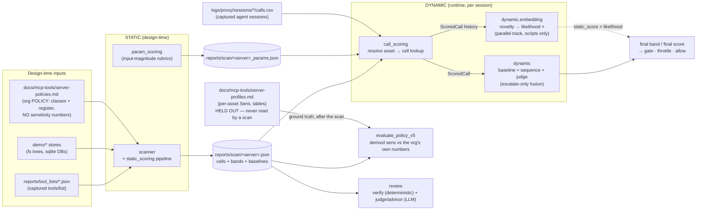
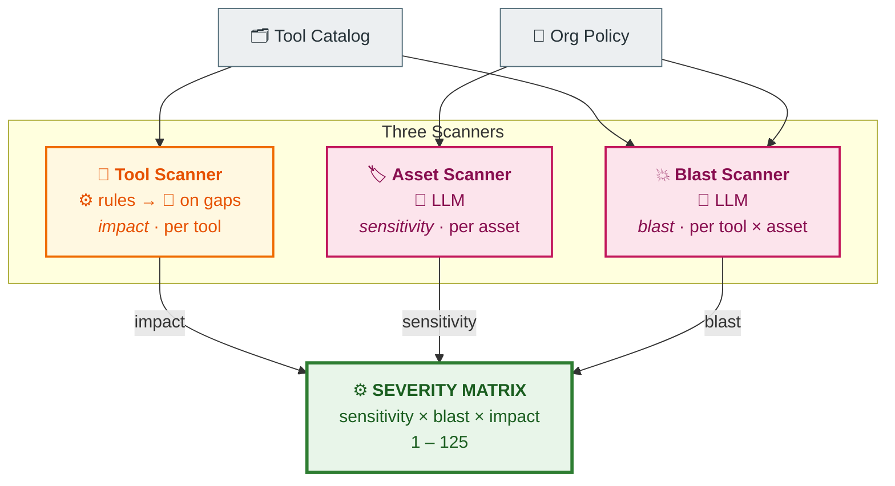
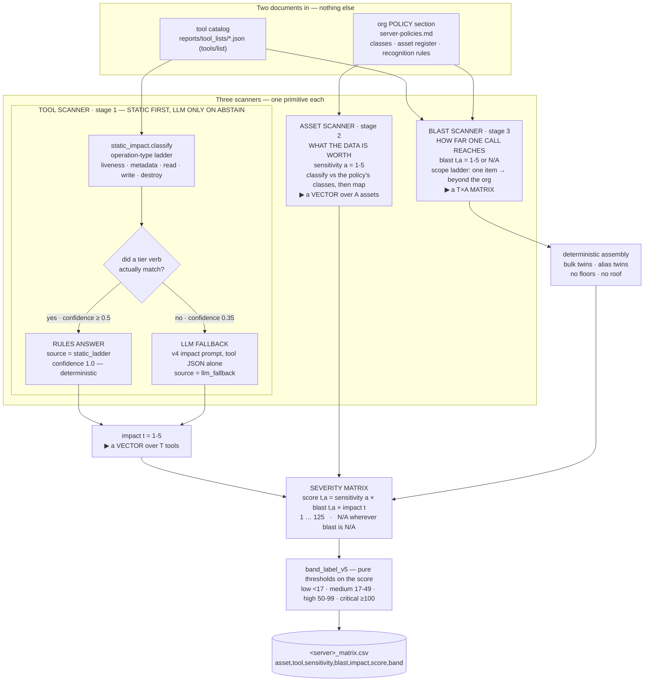
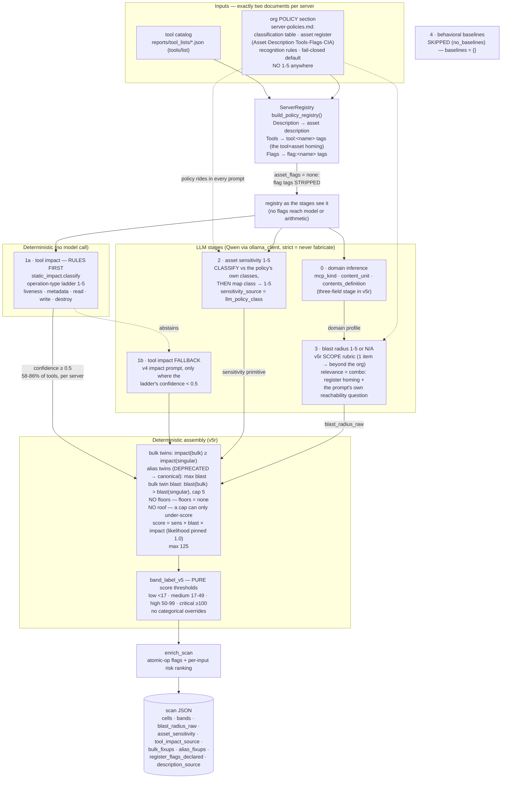
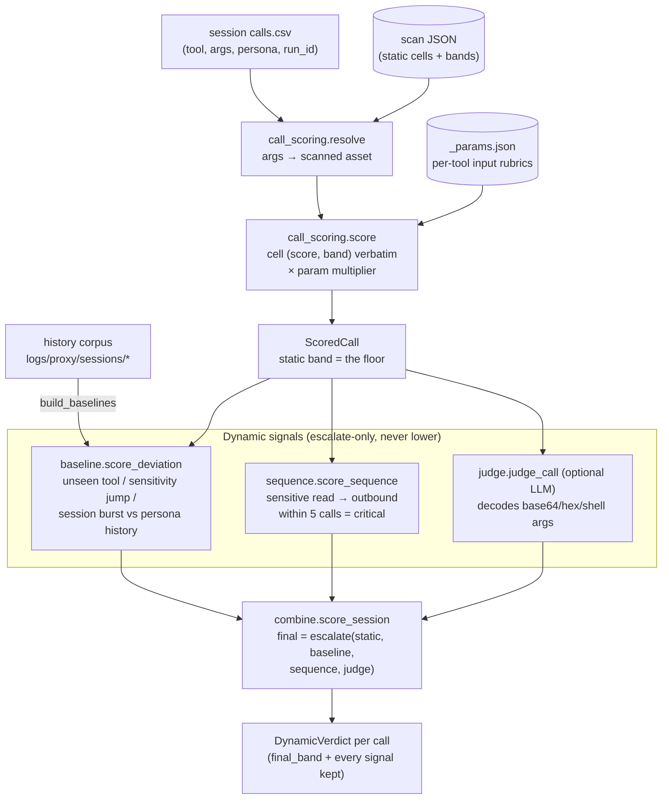
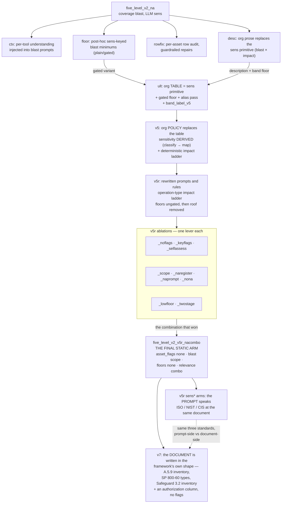

# Architecture Diagrams

Input/output and dataflow of the whole scoring system — the static (design-time)
pipeline, the dynamic (runtime) pipeline, and how they compose. Every box maps
to a real module; arrows are actual data flows (verified against the code and
against the scan artifacts, not aspirational).

> ⚠️ [`architecture.dot`](architecture.dot) (render:
> `dot -Tsvg architecture.dot -o architecture.svg`) has **not** been updated to
> the current arm. It still labels the static subgraph `five_level_v2_ult` and
> does not mention the policy document at all, so it describes the superseded
> shape where sensitivity was read off the org's `| Asset | Sens. |` table. This
> Markdown file is the current source of truth.

Threat direction everywhere: **the MCP server is the protected asset; the agent
is the threat**. Static scoring prices what each (tool, asset) cell *could* do;
dynamic scoring prices what a specific session *is* doing.

## 1. Bird's-eye: static feeds dynamic

**The profile document is not a scanner input.** `server-profiles.md` hands over a
per-asset `Sens.` number; `server-policies.md` deliberately does not. Every policy
arm reads the policy and *derives* the number, and `policy_for()` raises
`PolicyNumbersError` if an `| Asset | Sens. |` table ever appears in a policy
section. The profile's numbers are the held-out ground truth
`scripts/evaluate_policy_v5.py` grades against afterwards — and only for the three
servers whose profile ids align (`calendar_real`, `github_real`, `slack_real`).

## 2. The three scanners and the severity matrix

The whole static side is three scanners, each producing exactly one primitive, and
one multiplication. Nothing else contributes to the score.

### 2a. At a glance

Two documents in, three scanners, one multiply. Colour and icon carry how each
number was decided: **⚙️ blue = deterministic rules**, **🤖 pink = LLM**,
**🔧 amber = rules first, LLM only where the rules have no verb**.

Three things this view is meant to make obvious, and everything else is detail:

1. **Only two documents go in.** No file tree, no per-asset number.
2. **Each scanner owns one primitive**, and only blast is indexed by both tool
   and asset — which is why the matrix has structure at all.
3. **Most of the pipeline is arithmetic, not judgement.** The model is consulted
   in three places; the multiply and the banding are reproducible.

### 2b. In detail

**Yes — they multiply, and the shapes are what make the matrix interesting.**
Sensitivity is indexed by *asset* only and impact by *tool* only, so on their own
`sensitivity ⊗ impact` is a rank-1 outer product — every row would be a scaled copy
of every other. Blast is the only primitive indexed by *both*, so it is what makes
each cell genuinely its own number, and it is also the only one that can say **N/A**
(this tool does not touch this asset), which knocks the cell out of the matrix
entirely.

Four real rows from
`five_level_v2_policy_v5r_nacombo/fs_corp_filesystem_matrix.csv`:

| asset | tool | sensitivity | blast | impact | score | band |
|---|---|---:|---:|---:|---:|---|
| `security-keys` | `write_file` | 5 | 5 | 4 | **100** | critical |
| `security-keys` | `read_file` | 5 | 5 | 3 | 75 | high |
| `security-keys` | `get_file_info` | 5 | N/A | 2 | N/A | na |
| `public-overview` | `read_file` | 1 | 2 | 3 | 6 | low |

Same asset in the first three rows: sensitivity is pinned at 5 and only the verb
and the reach move. `get_file_info` drops out not because it is safe but because the
blast scanner ruled it does not reach that asset — metadata about a key file is not
the key.

### The tool scanner's static-first hand-off, and why it is auditable

The ladder does not "try and fail" — it reports a confidence, and
`confidence < STATIC_IMPACT_MIN_CONFIDENCE` (0.5) means one specific thing: **no
tier verb matched at all**, so the ladder would have had to fall back on its own
default rather than on evidence. `static_impact.classify` emits exactly `0.35` in
that case, so the gate is really "did a verb fire, yes or no".

When it hands off, the artifact keeps what the ladder *would* have said, so the
hand-off can be second-guessed later. Both abstentions on `fs_corp_filesystem`:

| tool | ladder would have said | LLM said | outcome |
|---|---:|---:|---|
| `create_directory` | 4 | **4** | model agreed with the ladder's default |
| `move_file` | 4 | **2** | model overruled it by two tiers |

`move_file` is the case the fallback exists for: no verb in the ladder's vocabulary
fires on "move", the default would have priced it as a write (4), and the model
priced it as a rename that neither reads nor destroys content (2). Every such record
carries `abstained: true`, `static_would_have_said`, and the reason string
*"no tier verb matched, so the ladder would have used its default"*.

Coverage is per server and visible in `tool_impact_source`: 12/14 rules on
`fs_corp_filesystem`, 13/16 on `slack_vireo`, 9/13 on `calendar_aurora`, and only
15/26 on `github_helios` — the GitHub catalog carries the most verbs the ladder has
no rule for.

### What is *not* in the severity matrix

`param_scoring` is the third risk dimension and it is **not** a factor here. It
prices how much a call's *argument values* ask for, which cannot be known at design
time — `read_file(head=10)` and `read_file(head=100000)` are the same cell. Its
design-time half derives a per-tool rubric; its runtime half applies that rubric to
concrete arguments and combines the result with this matrix's band. See the note
below on inputs.

## 3. Static pipeline in detail — the final static arm, `five_level_v2_v5r_nacombo`

This is the arm the v5r experiments converged on and the reference every later arm
is compared against
([`reports/experiments/v5/five_level_v2_policy_v5r_nacombo/`](../../reports/experiments/v5/five_level_v2_policy_v5r_nacombo/)).
Two facts distinguish it from the older `ult` shape the previous version of this
diagram described: **sensitivity is derived, not looked up**, and **tool impact is
decided by rules, not by the model** except where the rules abstain.

### What this arm actually does, verified against the artifacts

| Stage | Where the number comes from | Evidence in the scan JSON |
|---|---|---|
| tool impact | deterministic ladder first; model only on abstention | `tool_impact_source` — 12/14 static on `fs_corp_filesystem`, 15/26 on `github_helios`, 13/16 on `slack_vireo`, 9/13 on `calendar_aurora` |
| asset sensitivity | LLM classifies against the policy's classes, then maps | `sensitivity_source: "llm_policy_class"` |
| blast radius | LLM, v5r scope rubric, may return N/A | `blast_radius_raw`, `null` cells → band `na` |
| floors | **none** | `blast_floor: {floors: {}, impact_floors: {}, raised_cells: 0}` |
| roof | **removed** | `blast_roof: {}` |
| flags | **none reach the model or the arithmetic** | `asset_flag_policy: "none"`; what the register declared is kept for audit only, in `register_flags_declared` |
| baselines | not run | `baselines: {}` |

The `register_flags_declared` field is the honest part of the flag removal: the
register still states `hub` / `population` / `self-sufficient`, and the artifact
records them, but no stage reads them. That is why removing the `Flags` column
outright in the v7 documents changed nothing arithmetically.

## 4. The two asset sources, and the parameter rubric

Three inputs in section 1 are easy to confuse. They answer different questions.

### `demo/*` stores — what physically exists

Real on-disk artifacts: `demo/corp_filesystem/` is an actual file tree
(`sensitive/`, `source_code/`, `projects/`, `onboarding/`), `demo/*_sqlite/` are
actual SQLite databases. Generated deterministically by
`scripts/build_corp_demo.py`. `scanner.scan.build_registry(kind, root=…)` **walks
them** — `reg.filesystem_assets(store)` enumerates the tree, `reg.sqlite_assets(store)`
reads the schema — so assets are *discovered from real structure*. Declarative kinds
(slack, calendar, github) front no local disk, so their assets come from code
registries instead.

### `server-policies.md` — what the organization calls an asset, and why it matters

Not a directory listing but a *statement*: a classification table defining classes
by adverse impact, an asset register, recognition rules, a fail-closed default.
`build_policy_registry()` takes asset ids, descriptions and the tool×asset homing
straight from the register rows.

**The policy arms never read the demo store.** Every v5 / v5r / nacombo / v7 scan
records `registry_source: "tool_catalog+org_policy_only"`. You can see it in the
asset ids: the disk-backed path yields path-shaped assets
(`sensitive/security/private_key.pem`), the policy path yields concept-shaped ones
(`security-keys`). Section 1 draws `demo/*` into the scanner because the
**older** `python -m mcp_security.scanner --kind filesystem --root demo/corp_filesystem`
entry point does use it, writing `reports/scan/<server>.json`. That is a different
driver from `scripts/scan_policy_v5.py`.

| | `demo/*` store | `server-policies.md` | `server-profiles.md` |
|---|---|---|---|
| Answers | what files/tables exist | what asset classes matter, and why | what each asset is worth (1–5) |
| Asset shape | paths, schemas | concepts | paths |
| Read by the policy arms? | **no** | **yes** | **no** — held-out ground truth |
| Supplies a number? | no | **no, by design** | yes |

### `param_scoring` — the input-magnitude rubric

The third risk dimension, orthogonal to (tool, asset): **how much does a call's
parameter values ask for?** Rules live in `docs/standards/parameter-scoring.md`,
which doubles as the LLM prompt.

- **Design time** — `param_scoring.derive` produces one rubric per tool into
  `reports/scan/<server>_params.json` (14 rubrics for the filesystem server). Each
  names the magnitude-bearing parameters, a `base_rank`, an extractor
  (`number` · `list_length` · `parsed_limit` · `boolean`) and ascending cutoffs.
  Real entry for `read_file`: parameters `head` and `tail`, `base_rank: medium`,
  `extract: number`, cutoffs `≥10 → low`, `≥50 → medium`, `≥100 → high`.
- **Run time** — `param_scoring.apply.score_call_params` applies that rubric
  deterministically to actual arguments, and `param_scoring.combine` merges the
  result with the cell's band (`escalate` or `combine_avg`).

So the rubric is derived statically but *cannot* enter the severity matrix: it needs
argument values, and a design-time cell has none. Do not confuse it with
`tool_input_ranking`, which `enrich_scan` attaches to the scan JSON — that is a
per-parameter risk annotation (1–5 plus a `critical_trigger`), documentation rather
than an applyable rubric.

## 5. Dynamic (runtime) pipeline in detail

## 6. Where each experiment changed the static pipeline

The two right-hand branches are the same three standards applied at different
layers, which is what makes them a pair: `sensiso` / `sensnist` / `senscis` change
only the sensitivity **prompt** while the organization keeps our register shape;
the v7 arms change the **document** the organization publishes and give each a
matching prompt. See
[`reports/experiments/v7/README.md`](../../reports/experiments/v7/README.md).

## Notes

- The two runtime composition tracks are separate by design
  (`docs/project/dynamic-scoring-design.md`): the **band track** (escalate-only,
  what `python -m mcp_security.dynamic` runs) and the **likelihood track**
  (`static_score × embedding likelihood`, wired into `scripts/eval_*` only).
- All LLM calls go through one chokepoint, `llm/ollama_client.query_ollama`
  (qwen2.5:32b, temperature 0, seed 0, no cloud fallback — callers degrade
  gracefully or, in strict scans, abort).
- `review/` re-derives every artifact deterministically (`verify`) and audits
  methodology with an LLM (`judge`, `advisor`) — assurance, not scoring.
- **Section 2 describes `five_level_v2_v5r_nacombo` specifically.** Earlier arms
  differ in exactly the levers section 4 names; the arm registry
  (`static_scoring/pipeline.py::_ULT_VARIANT_OPTIONS`) is the authority, and every
  scan records the arm it ran under in `impact_mode` plus the full lever set in
  `ult_variant_options`.
- `profile_sha256` in a scan artifact is a **legacy field name**. It hashes
  whatever organizational text the scan actually used, which for every policy arm
  is the policy section — not `server-profiles.md`.
- The score formula string in the artifact reads
  `asset_sensitivity * blast_radius * likelihood(1.0) * tool_impact`. Likelihood is
  pinned to 1.0 at design time by construction: a static cell prices what a call
  *could* do, so the static score is an upper bound. Likelihood is what the dynamic
  side supplies.
