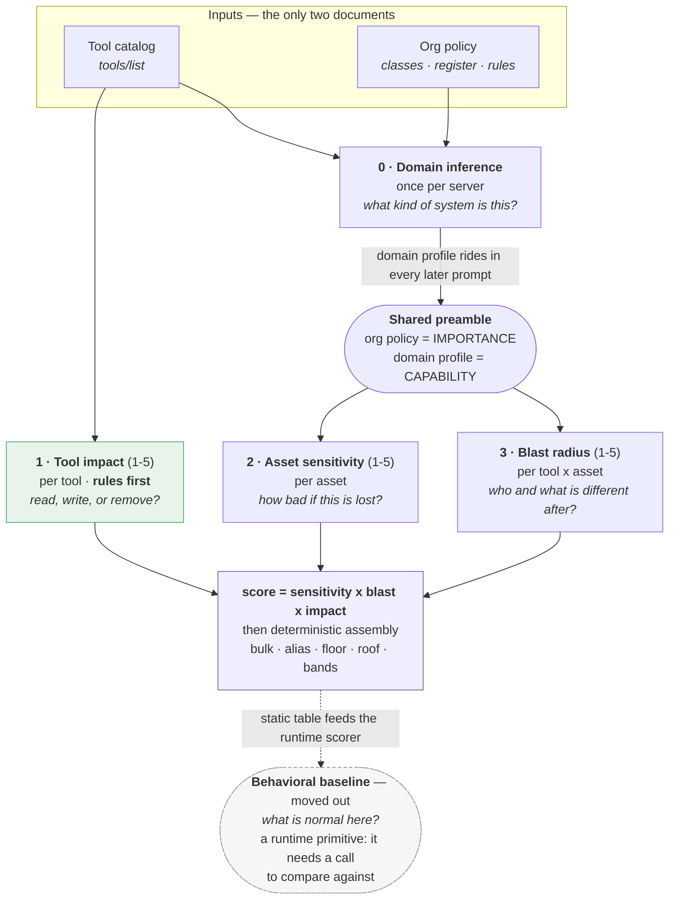

# What each prompt is for, and where it is overfit

Four prompts run in a v5r scan (v5 ran five — the behavioral baseline has moved
to the dynamic stage). This is one sentence on each, the pipeline they form, and
an audit of every line that looked fitted to this corpus rather than to the
problem.

## The pipeline



`static_impact.py` answers stage 1 first; the prompt is sent only for a tool
where the rules abstain.

## One sentence each

| # | Prompt | Its job, in one sentence |
|---|---|---|
| 0 | **Domain inference** | Read the whole registry once and say what kind of system this is, so every later prompt is judged in the right vocabulary. |
| — | **Shared preamble** | Put the organization's policy (authoritative for what matters) and the inferred domain (authoritative for what the tools can do) in front of every scoring decision. |
| 1 | **Tool impact** | Judge what *one call does* from the tool's own declaration — action type only, never how much it touches or what it is worth. |
| 2 | **Asset sensitivity** | Classify one asset against the organization's policy classes, then map that class's adverse-impact language onto 1–5. |
| 3 | **Blast radius** | Judge how far one call's consequences *propagate* — which subjects and systems are different afterwards — with value already priced by sensitivity. |
| — | ~~Behavioral baseline~~ | **Removed from the static scan.** It states what normal use looks like, which only means something once there is a call to compare against — a runtime primitive, and nothing in `sensitivity × blast × impact` consumed it. |

The three that multiply into the score are deliberately **orthogonal**: impact is
about the verb, sensitivity about the noun, blast about the quantifier. Every
audit finding below is a place where one of them leaks into another.

---

## Audit

### 0 · Domain inference — the worst offender

~2 400 characters, ten fields. Three problems:

**(a) A finance paragraph inside a domain-agnostic prompt.** The
`dangerous_classes` field carries:

> "PUBLIC data is NOT dangerous: data already published by an exchange,
> regulator, news outlet, or open API (public market quotes, filed financial
> statements, SEC insider-trade / Form 4 filings, institutional-holding / 13F
> filings, central-bank series)…"

Form 4 and 13F are in a prompt that runs against calendars and filesystems. This
was written to fix over-scoring on the finance scans and never generalized. The
principle — *already-published data has nothing to leak* — is one clause; the
rest is a list of one domain's document types.

**(b) Two paragraphs are scar tissue from specific failures.** The
`irreversible_actions` field spends 8 lines telling the model not to invent
write verbs ("if every tool in the registry is read-only … irreversible_actions
is an EMPTY list. Read the tools, not the topic."). The `dependency_hubs` field
spends 4 lines distinguishing itself from `dangerous_classes`. Both read as
arguments with a previous run rather than instructions.

**(c) Ten output fields, of which the later stages read four.**
`asset_meaning`, `blast_radius_meaning` and `worked_example` are prose the model
writes for itself and no rule consumes. Every one of them is re-serialized into
*every* subsequent prompt as part of the preamble, so their cost is paid ~1 000
times per server, not once.

**Direction:** cut to the fields that are actually consumed, state each in one
line, replace the finance list with the one clause that generalizes.

### 1 · Tool impact

- **Names `openWorldHint` as evidence** while `static_impact.py` deliberately
  ignores it. The prompt and the rules disagree about the same signal.
- **Tier 5 bundles "irreversible" with "crosses the system boundary."** Published
  four-tier agent frameworks separate these and rank external *below*
  irreversible — an email is unrecallable but bounded; a dropped table is not.
- The `readOnlyHint` ceiling has no prompt equivalent, so the LLM path and the
  rules path apply different bounds. Removing the ceiling from the rules also
  removes this inconsistency.

### 3 · Blast radius — the DISCIPLINE block

Four bullets, and three of them are doing something other than defining reach:

| Line | Problem |
|---|---|
| "If the asset carries NO escape flag … the ceiling is 4" | A hard cap written to kill one over-read (`recruiting / list-events = 5` in v3). It now silences the model on any server whose register author forgot a flag. |
| "Reading a listing, names, or metadata is reconnaissance … cannot exceed the metadata tier" | **Impact vocabulary inside the blast prompt.** "Metadata tier" is not a blast tier — blast tiers are 1 item / 2 slice / 3 broad / 4 total / 5 escapes. This sentence has no referent in its own rubric, which is why it reads as unclear. |
| "Physical size is a red herring" | An answer to a mistake, not a definition. |
| "CONSISTENCY: … must not differ by more than one tier without a reason you can state in one sentence" | Asks the model to be consistent with cells it cannot see (each call is independent), so it cannot comply. Real consistency enforcement already happens deterministically in the alias-twin pass. |

The tier-5 escape routes `(a) hub / (b) population / (c) irreversible-total` are
good — they are org-sanctioned and auditable. The DISCIPLINE block around them is
where the overfitting sits.

### 2 · Asset sensitivity

Mostly clean — the classify-then-map structure is standard practice (FIPS 199 /
SP 800-60 / Stanford / Berkeley all work this way) and it measured 100 % within
one tier. Two lines to look at:

- "PUBLIC OVERRIDE: … 'Financial' is not 'confidential'." Same finance scar as
  the domain prompt.
- "METADATA-ONLY: … cap it at 2" — a hard cap, with a prose exception attached.
  Caps are how this codebase has historically encoded "the model got this wrong
  once"; each one deserves the same scrutiny as the blast ceiling.

### 4 · Behavioral baseline — removed

It did not feed the score, and it was paying full preamble cost (the whole org
policy, per app) for a value no cell multiplied. Deviation from normal is
measurable only against an observed call, so the stage belongs to the dynamic
scorer. Dropped from v5r via the `no_baselines` option.

---

## Cross-cutting: the preamble tax

Every per-cell prompt carries the org policy *and* the serialized domain profile.
On github that is a ~900-word policy plus a ~10-field JSON blob, re-sent for each
of 520 blast cells and 20 sensitivity calls. Shortening stage 0's output is the
single highest-leverage size change available — it multiplies through everything.

## Evidence that shorter is not worse

- Concise rubric prompts have been measured matching or beating long ones on
  classification F1 while being materially shorter.
- Prompt-optimization work identifies exactly the failure this audit found:
  prompts tuned on a finite set learn *spurious features* of that set rather than
  the intended task, and the symptom is a classification boundary broader or
  narrower than the prompt states.
- The MCP guidance on annotations is explicit that hints inform decisions and
  must not enforce them — which is the argument for deleting both the
  `readOnlyHint` ceiling and the `openWorldHint` clause rather than reconciling
  them.

## Sources

- MCP blog, *Tool Annotations as Risk Vocabulary* — <https://blog.modelcontextprotocol.io/posts/2026-03-16-tool-annotations/>
- MindStudio, *Classify AI Agent Actions by Risk: A Four-Tier Framework* — <https://www.mindstudio.ai/blog/classify-ai-agent-actions-by-risk>
- CSA, *NIST AI RMF Agentic Profile* — <https://labs.cloudsecurityalliance.org/agentic/agentic-nist-ai-rmf-profile-v1/>
- *LLMs Designing and Applying Evaluation Rubrics* (EACL 2026 Findings) — <https://aclanthology.org/2026.findings-eacl.335.pdf>
- *Prompts Generalize with Low Data: Non-vacuous Generalization Bounds…* — <https://arxiv.org/pdf/2510.08413>
- *How Useful Is Cross-Domain Generalization for Training LLM Monitors?* — <https://arxiv.org/pdf/2605.12265>
- *Prompt Compression for Large Language Models: A Survey* — <https://aclanthology.org/2025.naacl-long.368.pdf>
- CVSS v4.0 Specification — <https://www.first.org/cvss/v4.0/specification-document>

---

# v5r — what was changed

Mode `five_level_v2_v5r`. Every prompt below is new; the v5 originals are
untouched so the two arms compare on identical inputs.

| Prompt | v5 | v5r | Change |
|---|--:|--:|---|
| Domain inference (system) | 3 369 | **768** | −77 % · ten fields → three |
| Blast radius (task) | 2 828 | **1 546** | −45 % · DISCIPLINE block cut to one line |
| Tool impact (task) | 2 183 | 2 209 | same size, new ladder — and now sent only on abstention |
| Asset sensitivity | — | — | one line changed: the finance example generalized |
| Behavioral baseline | 1 per app | **0** | stage removed — a runtime primitive |

The domain saving is the one that compounds: its output is serialized into the
preamble of every sensitivity and blast call, so seven deleted fields come off
~540 prompts per server, not one.

## Domain inference — ten fields to three

Kept: `mcp_kind`, `content_unit`, `contents_definition` — what the blast stage
needs to reason about "one item".

Deleted, with reasons:

| Field | Why it went |
|---|---|
| `dependency_hubs` | The organization now **states** its hubs — the register's `Flags` column. Asking the model to infer them alongside invited the two to disagree. |
| `dangerous_classes` | Same: this is the policy's classification table. It also carried the finance paragraph (Form 4, 13F, central-bank series) inside a domain-agnostic prompt. |
| `irreversible_actions` | Same: the policy's operation limits. Its 8 lines of "do not invent write verbs … Read the tools, not the topic" were an argument with a previous run. |
| `asset_meaning`, `blast_radius_meaning`, `worked_example` | Prose no stage consumed, re-serialized into every later prompt. |

## Tool impact — operation type

The ladder now asks one question: *does it read, write, or remove?* Scoped writes
share tier 3 with content reads; breadth is tier 4; removal and execution are
tier 5. Two clauses left the prompt:

- **open-world** — the channel is not the operation, so an outbound send is a
  write and boundary crossing is scored by the dynamic stage;
- **hints as bounds** — annotations may corroborate, never bound; a hint that
  contradicts the description is followed by the description and reported.

## Blast radius — the DISCIPLINE block

Removed three of four lines: the "ceiling is 4" cap (written to kill one v3
over-read), the "cannot exceed the metadata tier" line (impact vocabulary with no
referent among the blast tiers — the reason it read as unclear), and the
CONSISTENCY instruction (unfollowable, since each cell is a separate call;
consistency is enforced deterministically by the alias-twin pass).

Kept, restated positively: tier 5 requires a flag the organization's register
sanctions, and the relevance gate.

## Behavioral baseline — moved to the dynamic stage

Nothing in the static cell (`sensitivity × blast × impact`) multiplied it, and a
baseline only becomes meaningful once there is an actual call to compare against.
It cost one full policy-bearing prompt per app for a value the static table
carried but never used. `five_level_v2_v5r` sets `no_baselines`, so the artifact
records `"baselines": {}` and the dynamic scorer owns the primitive.

## Not yet run

Wired and smoke-tested offline; no GPU run has been made. The rule change alone
moves 22 of 55 tool impacts — see
[`STATIC_RULES.md`](STATIC_RULES.md#measured-effect--55-tools-three-servers) for
the movement and the three cases worth deciding first.


---

# Revision: blast measures propagation

The blast rubric counted **items** — "one item among many", "most of the asset".
No published definition of blast radius does that; they all measure how far a
consequence spreads across users and dependent systems. Counting rows breaks on
the obvious case: reading one credential file touches one item and reaches every
system that credential opens.

**What the rubric says now**

| tier | before | now |
|--:|---|---|
| 1 | one item among many | **almost nobody** — nothing and nobody depends on it |
| 2 | narrow slice | a few subjects |
| 3 | broad cut | **a group** — the people or systems attached to what was touched. *The normal case; start here.* |
| 4 | total, contained | the whole set, still inside the asset boundary |
| 5 | escapes | beyond, via one of four register-sanctioned routes |

Plus a worked instruction: *"Reading ONE password file touches one item and
compromises every system that password opens — that is a 5, not a 1."*

**The escape routes were split.** Route (b) previously read "population — flagged
`population` **or `self-sufficient`**". Those flags describe different things:
`population` is coverage (the asset holds every subject), `self-sufficient` is
content (what is inside is usable alone). Sharing one route let any tool touching a
`self-sufficient` asset claim tier 5 — which is why a single **post** into
`vireo-unblinding` scored blast 5, and why `history`/`replies`/`search` came out
4/5/5 on the same asset. There are now four routes:

```
(a) hub               other systems authenticate against it / load config from it
(b) self-sufficient   what the call RETURNS is usable on its own elsewhere
(c) population        one call reaches the asset's ENTIRE set of subjects
(d) irreversible-total the asset is destroyed with nothing left to restore
```

These live in the **blast** prompt only. The tool-impact prompt mentions no flag,
no register and no escape — a test now enforces that, because reach is not an
impact question.

**Side effect on the floors.** With the normal case at 3, the `sens 4 → blast ≥ 3`
floor is close to a no-op, so the double-counting of sensitivity (it multiplies
*and* sets a floor) shrinks without touching the floor rules.
