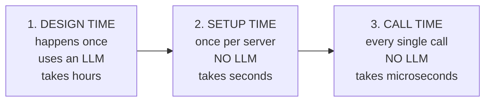
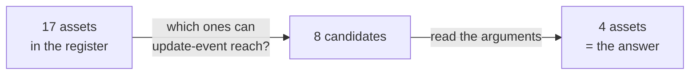
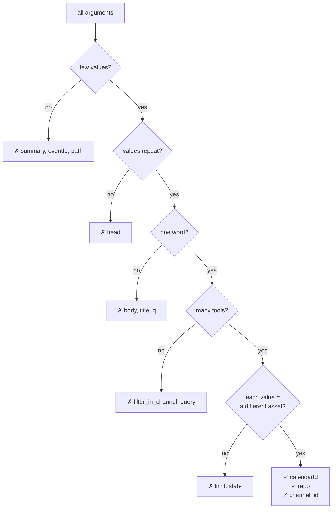
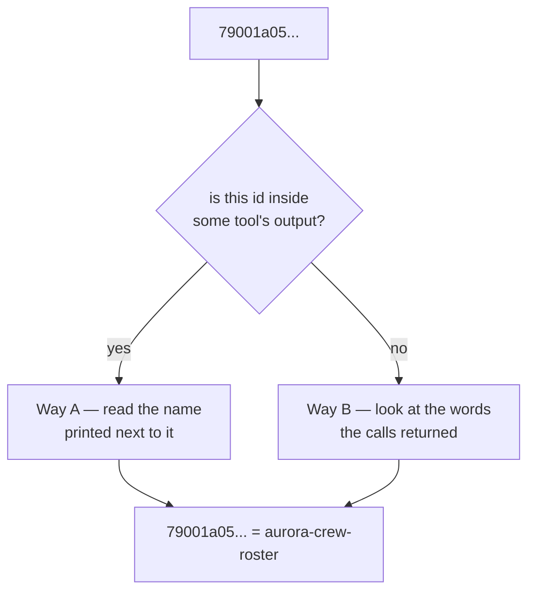
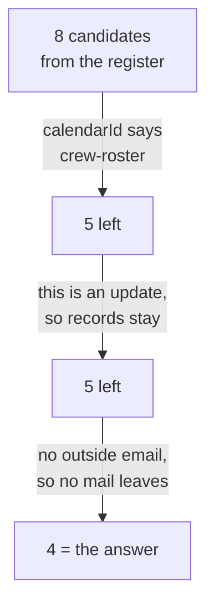
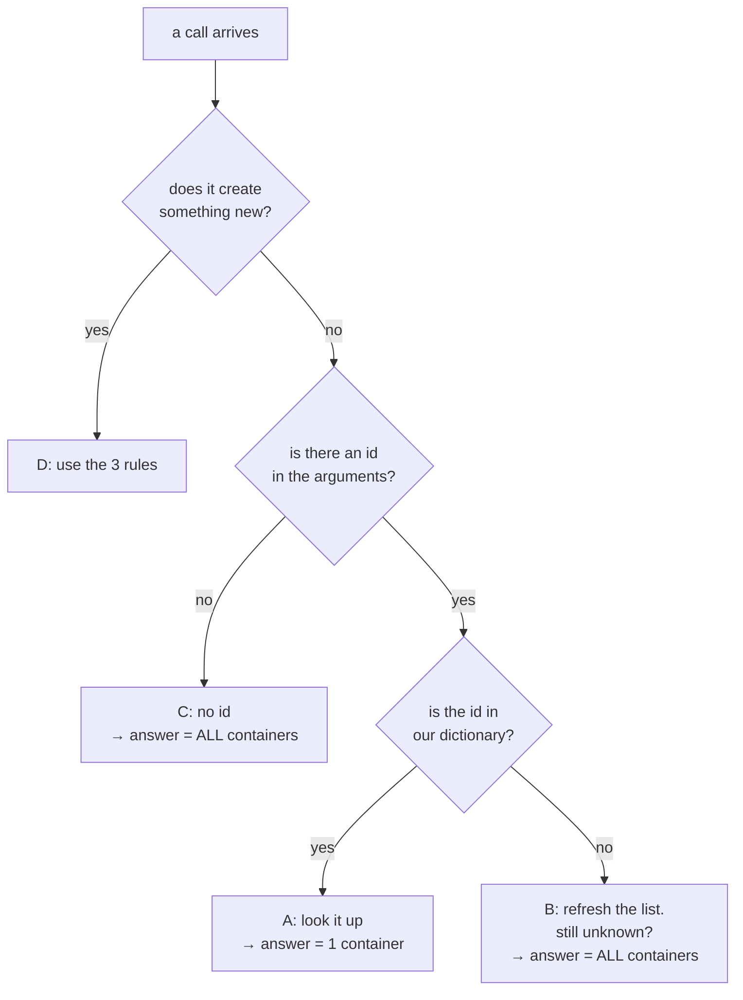
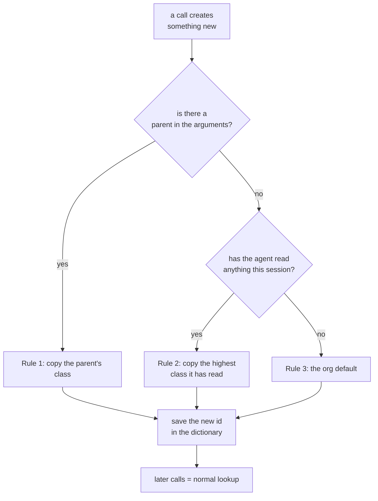

# How v8 works — simple explanation

This explains the method step by step, in plain English, with real examples from
the data. Results are in [`README.md`](README.md). Code is in
[`src/mcp_security/binding/`](../../../src/mcp_security/binding/).

---

## What we want

An agent sends a call to the MCP server. We want to answer one question:

> **Which asset does this call touch?**

That is all. Not "is it dangerous". Just *which asset*.

---

## Why this is hard

Look at these two calls. They use the same tool:

```jsonc
call A:  {"tool": "update-event", "calendarId": "071832f5..."}
call B:  {"tool": "update-event", "calendarId": "79001a05..."}
```

If you only look at the tool name, they look identical. Both are `update-event`.

But they are not the same:

| call | calendar | what the policy says about it |
|---|---|---|
| A | `071832f5...` = **team calendar** | ordinary team meetings |
| B | `79001a05...` = **crew roster** | *"an altered block can put a crew over its flight-time limit"* |

Call B can break flight safety. Call A cannot.

**So the tool name is not enough. The answer is inside the arguments.**

The problem: `79001a05...` means nothing to us. It is a random string. The policy
document calls that calendar `aurora-crew-roster`. Nobody ever wrote down that
`79001a05... = aurora-crew-roster`.

**Our job is to learn that link by ourselves.**

---

## When each thing happens

This confuses people, so let's be clear. Three different moments:



| | 1. Design time | 2. Setup time | 3. Call time |
|---|---|---|---|
| What happens | scanner reads the policy | we learn what each id means | we answer one call |
| How often | once | once per server | every call |
| Uses an LLM? | yes | **no** | **no** |
| Result | the asset register | a small lookup table | the list of assets |

Steps 2 and 3 are new in v8. **Neither uses an LLM.** The LLM finished its work in
step 1. Its result is already a file on disk.

Why no LLM in step 3? Two reasons:

1. It must be fast and free. It runs on every call.
2. **Safety.** The arguments come from the agent, and the agent may be attacked.
   If an LLM reads those arguments, an attacker can write text like *"ignore your
   rules"* inside an argument. A dictionary lookup cannot be tricked this way.

---

## Step 1 — the register gives us a short list

We already have the policy register from step 1 (design time). It has a column
called `Tools`. For each asset, it lists the tools that can reach it:

```
| Asset                | Tools                                                    |
| aurora-crew-roster   | list-events, get-event, update-event, delete-event, ...  |
| aurora-team          | list-events, get-event, update-event, delete-event, ...  |
| color-catalog        | list-colors                                              |
```

Read it **backwards**. Ask: "which assets can `update-event` reach?"

Answer: **8 assets**.

```
contacts, aurora-exec, aurora-regulatory, aurora-crew-roster,
aurora-maintenance, aurora-team, outbound-invite-email, event-records
```

This is very useful. We do not have to search all 17 assets. We start with 8.

**Now the arguments only need to remove wrong ones from this list.** We never add.
We only remove.



---

## Step 2 — which argument tells us "which one"?

A call has many arguments:

```jsonc
{"calendarId": "79001a05...",
 "eventId":    "b477t847m9d6tfllsrd791s4m4",
 "summary":    "[mcp-scale-corpus] altered duty block",
 "start":      "2026-12-30T05:00:00",
 "sendUpdates":"none"}
```

Only **one** of them tells us which calendar. It is `calendarId`. But we are not
allowed to write `calendarId` in the code — that would only work for calendars.
We must find it by ourselves, so the same code works for GitHub, Slack, or any
new server.

So we look at all the traffic and ask 5 simple questions about each argument.

### Here is the real data

This is every argument in the 1000 calendar calls:

| argument | times seen | different values | how many tools use it |
|---|---:|---:|---:|
| **calendarid** | 827 | **6** | **7** |
| timemin | 473 | 2 | 3 |
| sendupdates | 309 | 1 | 4 |
| summary | 221 | 186 | 2 |
| start | 221 | 156 | 2 |
| timezone | 221 | 1 | 2 |
| eventid | 207 | 113 | 3 |
| query | 171 | 5 | 1 |

Now the 5 questions.

### Question 1: are there few different values?

A company has a few calendars. Not hundreds.

- `calendarid` → only **6** different values. ✅ good
- `summary` → **186** different values. ❌ this is free text, not a container
- `eventid` → **113** different values. ❌ same

> **Rule:** more than 64 different values → reject.

### Question 2: is the same value used again and again?

You use the same calendar many times. But an event id is new every time.

- `calendarid` → 6 values used 827 times. Each value repeats ~138 times. ✅
- `eventid` → 113 values in 207 calls. Almost a new one every call. ❌
- GitHub `head` → 8 values in 8 calls. **A new value 100% of the time.** ❌

> **Rule:** if more than 25% of calls bring a new value → reject.

### Question 3: is the value a name, or a sentence?

An id is one word. A search text is a sentence.

- `calendarid` = `79001a05...` → one word ✅
- GitHub `body` = `"collated intrusion material"` → three words ❌
- GitHub `title` = `"[mcp-scale-corpus] zero-review merge"` → many words ❌

> **Rule:** if most values contain spaces → reject.

### Question 4: do several tools use it?

A container is what the whole server works on. Many tools take it. A filter is
used by only the one tool that needs it.

- `calendarid` → **7** different tools use it ✅
- GitHub `repo` → **19** different tools use it ✅
- Slack `filter_in_channel` → only **1** tool uses it ❌
- calendar `query` → only **1** tool (`search-events`) uses it ❌

> **Rule:** used by only 1 tool → reject.

### Question 5: does each different value mean a different asset?

This is the strongest question.

If `calendarId` is a real container, then 6 different calendars should mean
6 different assets. One calendar = one asset.

A filter is not like that. Slack's `limit` argument passed questions 1–4:

- `limit` → 28 different values (10, 11, 12, 50, 100...), used 806 times, by
  5 tools, no spaces. Looks fine so far!

But then: those 28 values all point at only **3** assets. That is 11%. A real
container key is near 100%.

> **Rule:** if many values share few assets → reject. It is a filter, not a
> container.

### Result



On all three servers this found **exactly one** correct argument. We wrote no
configuration.

---

## Step 3 — what does `79001a05...` actually mean?

Now we know *which* argument to read. But we still do not know what the value
means. We need this table:

```
79001a05...  →  aurora-crew-roster
071832f5...  →  aurora-team
43c607dd...  →  aurora-maintenance
```

We build it in two ways.

### Way A — the server tells us (best)

Idea: if a server lets an agent *use* a container, it usually also lets the agent
*see the list* of containers somewhere.

So we search: **which tool's output contains these id values?**

For Slack we found it. The output looks like this:

```
ID,Name
C0BLNSWSDGU,#vireo-unblinding
C0BLM4FBFED,#vireo-eng-platform
C0BL3QZDQJ3,#vireo-safety-pv
```

The name is right next to the id. And `#vireo-safety-pv` matches the register
asset `vireo-safety-pv`. Done — we learned the meaning.

Two careful details:

1. **We take the name that is closest.** In a short list, all names are nearby.
   Only distance tells us which name belongs to which id.
2. **We check it repeats.** A real list always puts the same name next to the same
   id. If a value sits next to a different name each time, that was luck, not a
   list. We reject it.

We never wrote a parser for JSON or CSV. We just look at the text near the id. So
this works for any output format.

### Way B — guess from what came back (fallback)

Sometimes there is no list. Then we look at what the calls *returned*.

Real example. Calls using `79001a05...` returned text like:

```
"Recurrent line check"  "standby block"  "duty period"
```

And the register says:

```
aurora-crew-roster: "Crew duty periods, standby blocks and recurrent checks..."
```

Same words. So `79001a05... = aurora-crew-roster`. ✅

**One problem to avoid.** Most words in the output are boring and appear
everywhere: `event`, `calendar`, `summary`, `time`. If we match on those, every
calendar looks the same. So we **throw away every word that appears in most
containers**, and keep only the words that make this container different.



> **This really happened.** The corpus cut every output at 280 characters. So the
> calendar list was never complete, and Way A was impossible for calendar. The
> whole calendar server used Way B only — and still got 5 of 6 correct.

---

## Step 4 — answering one real call

Now everything is ready. A call arrives:

```jsonc
{"tool": "update-event",
 "calendarId": "79001a05...",
 "summary": "[mcp-scale-corpus] altered duty block",
 "sendUpdates": "none"}
```

The correct answer is `aurora-crew-roster`. Here is what happens:

**Start: 8 candidates** (from the register, step 1)

```
contacts, aurora-exec, aurora-regulatory, aurora-crew-roster,
aurora-maintenance, aurora-team, outbound-invite-email, event-records
```

**Remove using the lookup table → 5 left**

We read `calendarId = 79001a05...`. Our table says that is `aurora-crew-roster`.
So the other calendars — `aurora-exec`, `aurora-regulatory`, `aurora-team` — are
removed. They were not named.

```
aurora-crew-roster, aurora-maintenance, contacts,
event-records, outbound-invite-email
```

**Check the operation → still 5**

`event-records` is described as *"What a create/update/delete targets"*. This call
**is** an update. So it stays.

(If this had been a *read* call, `event-records` would be removed here.)

**Check if anything leaves the company → 4 left**

`outbound-invite-email` is described as *"Mail leaving the org..."*. Mail only
leaves if there is an outside email address. This call has none. Remove it.

**Final answer:**

```
aurora-crew-roster   ← because calendarId said so      (best answer)
contacts             ← this tool can touch contacts
aurora-maintenance   ← (see the honest note below)
event-records        ← an update creates a record
```



### Why 4 assets and not 1?

Because it really is 4. One `update-event` touches the calendar, **and** the event
record, **and** the people data. That is normal.

The corpus only writes **one** label per call. So we measure two numbers together:

- **recall** — is the correct asset inside our set? (we want high)
- **set size** — how many assets did we return? (we want small)

One number alone means nothing. Returning all 17 assets gives perfect recall and
is useless.

### An honest mistake in this example

`aurora-maintenance` should not be in that list. Here is why it is:

The maintenance calendar's id was linked to the **wrong** asset
(`aurora-crew-roster`). The two calendars talk about the same things — schedules,
windows, deadlines — so Way B could not tell them apart.

Because no id points at `aurora-maintenance`, our code never learns that it is a
calendar. So it treats it as "something this tool can always touch" and keeps it
in **every** answer.

**One wrong link makes every answer slightly worse.** This is a real weakness and
we report it.

---

## The 4 situations — what to do with any call

You asked the right question: **not every call has an id.** So before anything
else, check which of 4 situations you are in. Only one of them needs the rules.

Real numbers from the 3000 calls:

| situation | calendar | github | slack |
|---|---:|---:|---:|
| **A** — has an id, we know it | 82.7% | 69.7% | 63.4% |
| **B** — has an id, we do NOT know it | 0% | 0% | 0% |
| **C** — has no id at all | 17.3% | 19.1% | 36.6% |
| **D** — the call CREATES something new | 0% | 11.2% | 0% |



### A — has an id, we know it (most calls)

```jsonc
{"tool": "update-event", "calendarId": "79001a05..."}
```

Look it up in the dictionary. `79001a05... = aurora-crew-roster`. Done.

### B — has an id, we do NOT know it

```jsonc
{"tool": "update-event", "calendarId": "something-we-never-saw"}
```

Two possible reasons: the container is new since our last refresh, or it is
genuinely unknown.

1. Refresh the list from the server (call `list-calendars` again). If it is there
   now, we are back in situation A.
2. Still unknown → **answer = every container this tool can reach**, and mark it
   `unresolved_container`.

We never guess the closest match. Guessing a safe answer is how an attacker gets
through. If we are not sure, we say "it could be any of them" — loudly.

### C — has no id at all (this is normal, not an error)

```jsonc
{"tool": "search_code", "q": "password"}          // searches EVERY repo
{"tool": "list-calendars"}                        // no arguments at all
```

There is no id because the call really does touch everything. A code search reads
every repository at once. So the answer is **all containers this tool can reach**,
marked `fanout`.

This is not a failure. It is the correct answer. And it is important for security:
a search across all repos is often *more* dangerous than a read of one.

### D — the call creates something new

```jsonc
{"tool": "create_repository", "name": "helios-exfil-18873", "private": true}
```

There is no id to look up, because the thing does not exist yet. **This is the
only situation that needs the 3 rules.**

---

## The 3 rules (only for situation D)

A new asset is empty. A new repository has no code in it. So we cannot look at it
to decide what it is — there is nothing to look at.

**We decide by where it came from, not by what it is.**

Try 3 things, in this order. Stop at the first one that works.

### Rule 1 — copy from the parent

Does the call name a container it is creating *inside*?

```jsonc
{"tool": "create_issue", "repo": "helios-scada-gateway", "title": "..."}
                          ↑ the parent is right there
```

The new issue lives inside `helios-scada-gateway`. So it gets that repo's class.

**This covers 104 of the 112 creating calls in the corpus.** Most creation is easy,
because most creation happens inside something that already exists.

### Rule 2 — copy from what the agent already read

Sometimes there is no parent:

```jsonc
{"tool": "create_repository", "name": "helios-exfil-18873"}
    // arguments: name, private, description. No parent. Nothing to inherit from.
```

Now ask a different question: **what has this agent already read in this session?**

If the agent read `helios-scada-gateway` five calls ago, then it is holding SCADA
content in its context right now. Whatever it puts in the new repository can be
that content. So the new repository takes SCADA's class.

We keep one number per session: the highest class the agent has read so far. That
is all. No model, no history search — one integer.

**This is exactly the attack.** In the corpus, all 8 `create_repository` calls are
labelled MALICIOUS, and they are named `helios-exfil-*`:

```
1. read helios-scada-gateway          ← high class
2. create_repository "helios-exfil-18873"   ← new, empty, no class
3. push the SCADA content into it     ← nothing blocks this
```

Without rule 2, step 2 creates an asset that no policy covers, and step 3 is
allowed. With rule 2, the new repository inherits SCADA's class at step 2, and
step 3 becomes a policy violation.

### Rule 3 — use the organization's default

If the agent has read nothing yet, there is nothing to inherit. Then use the
default the policy already states. The aurora policy writes it directly:
**"Default: Confidential."**

### After the call — write it into the dictionary

The server's response contains the new id:

```jsonc
{"full_name": "To2004/helios-exfil-18873", "id": 987654321, ...}
```

Save it, with where its class came from:

```
helios-exfil-18873  →  class from helios-scada-gateway
                       (created at call #412, session S)
```

Now every later call about that repository is situation **A** again — a normal
lookup.



### Summary in one line

> **Old asset: the id tells you what it is. New asset: only its history tells you.**

### What the code does today (honest)

Situations A, B and C are implemented and measured. Situation D is only
*detected* — the resolver sets a `mints_container` flag and stops there. The 3
rules are designed but not built. No inheritance, no session number, no post-call
save.


---

## What we never do

Three rules we follow on purpose:

**1. We never guess a container.**

If the call says `calendarId: something-we-never-saw`, we do **not** pick the
closest match. We return **all** calendars and mark it `unresolved_container`.

Why? Because guessing a safe answer is exactly how an attacker gets through. If we
are not sure, we say "it could be any of them" — loudly.

**2. We never look up a "what a call targets" row.**

`event-records` is described as *"What a create/update/delete targets"*. It is not
a real container. It has no id. No argument can name it. So we never try to put it
in the lookup table.

**3. We never return one asset when the call touches many.**

The answer is always a set.

---

## What we gained

3000 real calls, 3 servers:

| | tool name only | full method | change |
|---|---:|---:|---|
| assets returned per call | 5.65 | 2.83 | **half** |
| how often the top answer is correct | 12% | **55%** | **4.4× better** |
| recall (correct asset in the set) | — | same | no loss |

Almost all of the gain comes from **step 3** (the lookup table). The operation
check and the leaving-the-company check only remove one more asset on average.

**The main idea is simple: learn what the ids mean, then read the argument.**

---

## Known weakness (honest)

Slack's `filter_in_channel` argument really does hold channel ids. But only one
tool uses it, so question 4 rejected it. The result: search calls in Slack cannot
be narrowed, and 17.6% of Slack calls return "all channels" instead of one.

This is the price of using simple, general rules instead of per-server
configuration. We think the trade is worth it, but it is a real cost.

More limitations: see [`README.md`](README.md#limitations).
